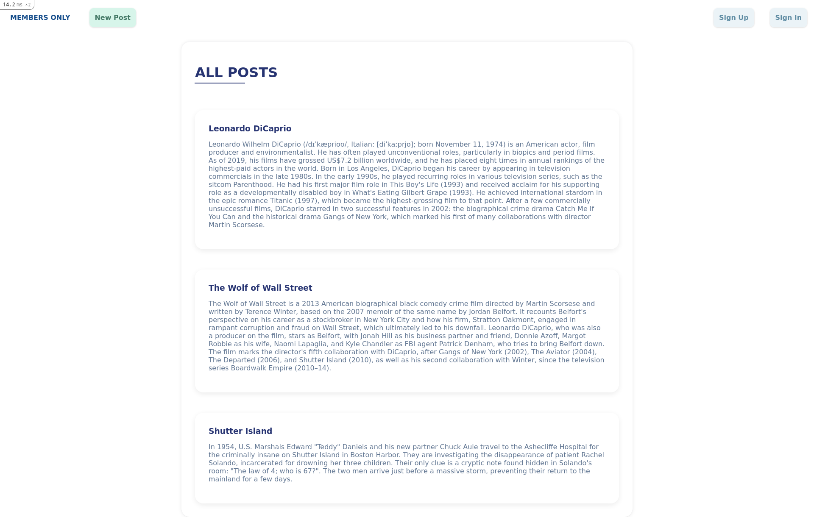

# Members_Only

## Table of Contents

* [About the Project](#about-the-project)
* [Built With](#built-with)
* [Getting Started](#getting-started)
* [Prerequisites](#prerequisites)
* [Contributing](#contributing)
* [Authors](#authors)
* [Acknowledgements](#acknowledgements)

## About Project

In this project we have implemented an authentication system to a post sharing applicatioin. Users can only access areas of a site they are authorized to.

## Built With

- Ruby v2.7.2
- Rails 6
- SQLite3


## Getting Started

* Clone this repo
    ```
    git clone https://github.com/DeliceLydia/members_only.git
    ```
* Navigate to members_only folder
    ```
    cd members_only
    ```
* On the terminal, while in the 'members_only' directory, run the following to install dependency:
    ```
    bundle install
    ```
* At this point, you still don't have the SQLite database. Run the following to get setup:
    ```
    rails db:migrate
    ```
* To interact with the project, run:
    ```
    rails server
    ```

    OR

    ```
    rails s
    ```
* Go to the browser and enter 
    ```http://localhost:3000``` to go to the homepage which display links to all posts

### Prerequisites

- Ensure you have these installed:
    - Git
    - Ruby 2.7.2
    - Ruby on rails ```gem install rails```

- You also need to ensure your yarn is upto date
    ```
    yarn install --check-files
    ```

## Contributing

Contributions, issues, and feature requests are welcome!

Feel free to check the [issues page](https://github.com/DeliceLydia/members_only/issues).

## Authors

  *Anas Siddiqui*
  - GitHub: [@githubhandle](https://github.com/smcommits)
  - LinkedIn: [linkedIn](https://linkedin.com/in/sm-anas)


👤
👤 **Delice Lydia**
  - GitHub: [@githubhandle](https://github.com/DeliceLydia)
  - Twitter: [@twitterhandle](https://twitter.com/IngabireLydia)
  - LinkedIn: [LinkedIn](https://twitter.com/IngabireLydia3)

## Acknowledgements
Credits go to the following for providing guides on Ruby on Rails
  - [**Rails Guides**](https://guides.rubyonrails.org/form_helpers.html )

## Show your support

Give a ⭐️ if you like this project!
